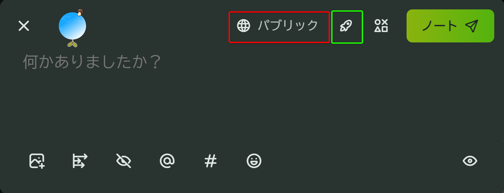
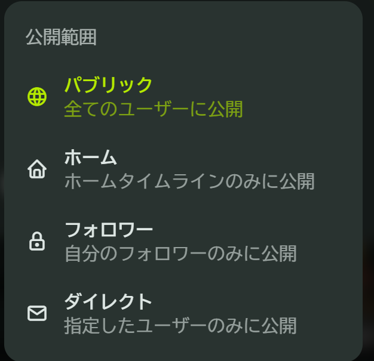
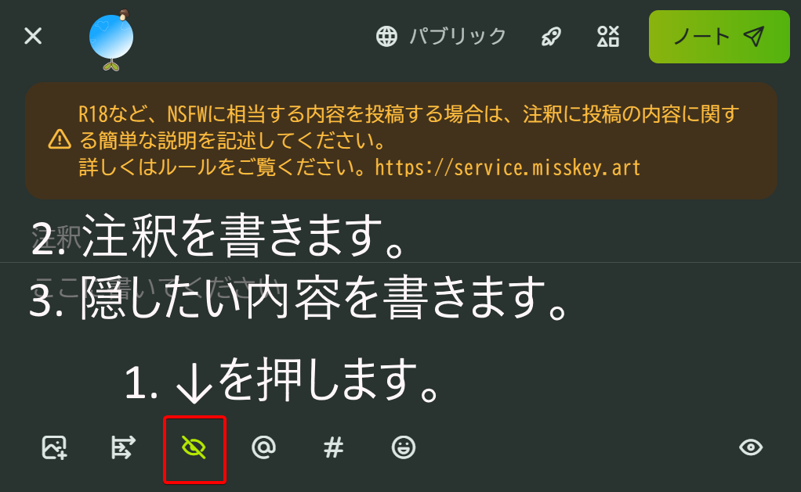
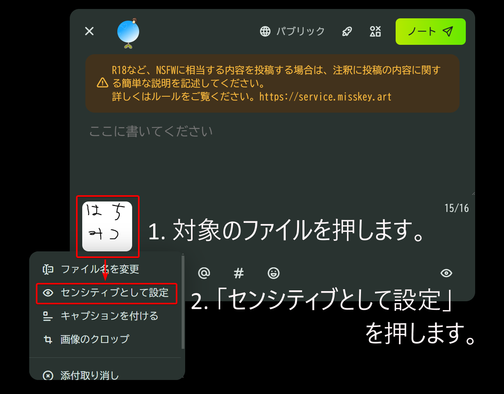
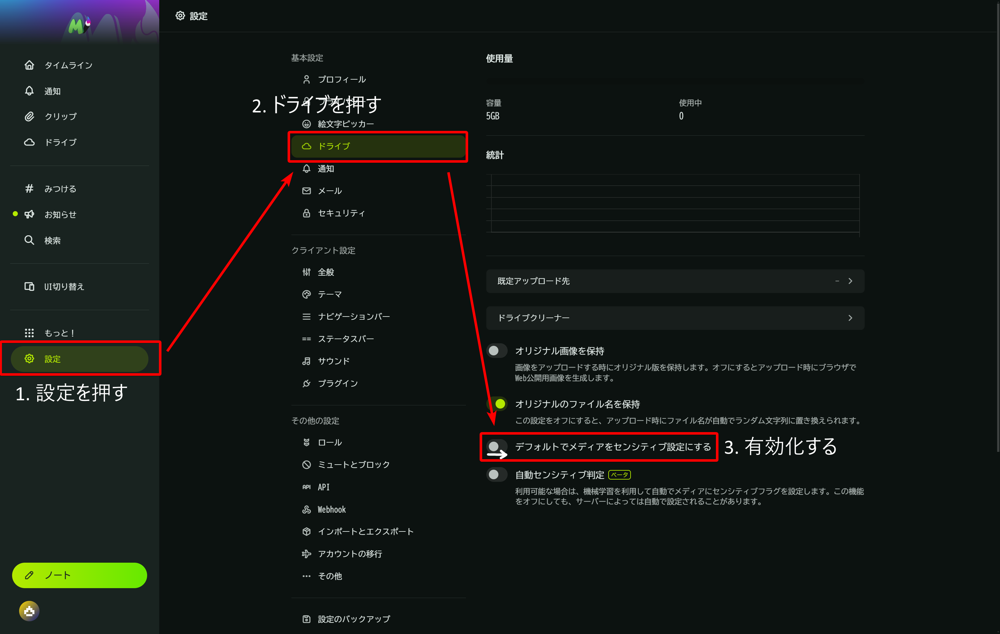

# 投稿ガイドライン

::: details ノートの仕様 - [公開範囲](https://misskey-hub.net/ja/docs/for-users/features/note/#%E5%85%AC%E9%96%8B%E7%AF%84%E5%9B%B2)

ノートはデフォルトで「グローバルタイムライン」という、全員が見られるタイムラインに公開されます。
公開範囲は「ノート」画面右上の「🌐」マーク（公開範囲）から変更できます。

\

- パブリック（これがデフォルトです）
  - すべての人々に対して公開されます。
  - 「グローバルタイムライン」という **「Misskey.artと連合しているサーバーの全員が見られるタイムライン」** でも表示されます。
  - **アカウントがサイレンス状態の場合、パブリックでのノートはできません。**
- ホーム
  - すべての人々に対して公開されます。
  - 「ローカルタイムライン」には表示されず、「ホームタイムライン」「ソーシャルタイムライン」「自身のプロフィール」で表示されます。
- フォロワー
  - **「自身のフォロワー」にのみノートを公開します。**
- ダイレクト
  - **「特定のユーザー」にのみノートを公開します。**

::: tip
**公開範囲の設定と併せて、「連合なし」という設定ができます。**

- 緑に囲まれているロケットアイコンで切り替えできます。
- 他のサーバーから照会できなくなります。

:::

## [内容を隠す](https://misskey-hub.net/docs/glossary#cw)、[閲覧注意](https://misskey-hub.net/docs/glossary#nsfw)、デフォルト閲覧注意の設定方法

### [内容を隠す](https://misskey-hub.net/docs/glossary#cw)のやり方

### [閲覧注意](https://misskey-hub.net/docs/glossary#nsfw)のやり方

### デフォルト閲覧注意の設定方法

## 「Misskey.art 派生キャラクター」に関するガイドライン

- **キャラクターデザインに関しては自由です。** 思い思いの「Misskey.art派生キャラクター」を描いていただけると嬉しいです！
- 過激な作品はNGではありませんが、推奨もしません。あくまでも「禁止はしてないよ」レベルです。
- **キャラクターへの愛のない (敬意のない、ぞんざいな) 扱いは NG です。**
  - ただしR-18G作品においては「一種の愛の形である」と自己認識しているのであればほぼ問題ありません。\
    その場合はルールに従って投稿してください。
- **いかなるプラットフォームであっても政治的用途での使用は全面禁止です。**

### Misskey.art 内および関係場所 (Misskey.art Discord など)

- **基本的に自由です。**
- R-18, R-18Gその他**過激な作品の場合も投稿ガイドラインに従って[「閲覧注意」と「内容を隠す」設定](./note_guidelines.md#内容を隠す、閲覧注意、デフォルト閲覧注意の設定方法)をしていただければ問題ありません。**

### Misskey.art 外 (Twitter や Pixiv など)

- **必ず「Misskey.art 派生キャラクターであること」を記載してください。**
- **過激な作品は NG です。**

## 二次創作物の投稿に関して

[Misskey.art のルール](./../rules.md)だけでなく、**各作品の二次創作ガイドラインを遵守してください**。

