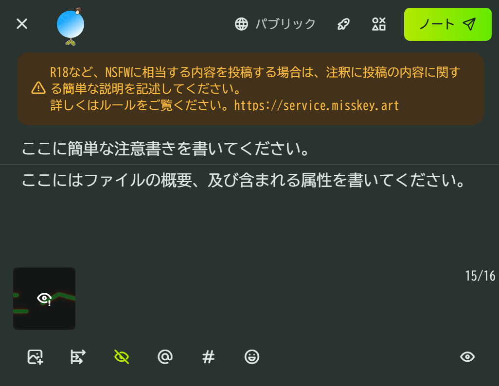
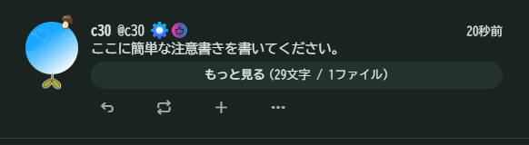
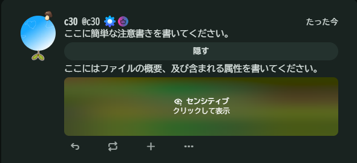
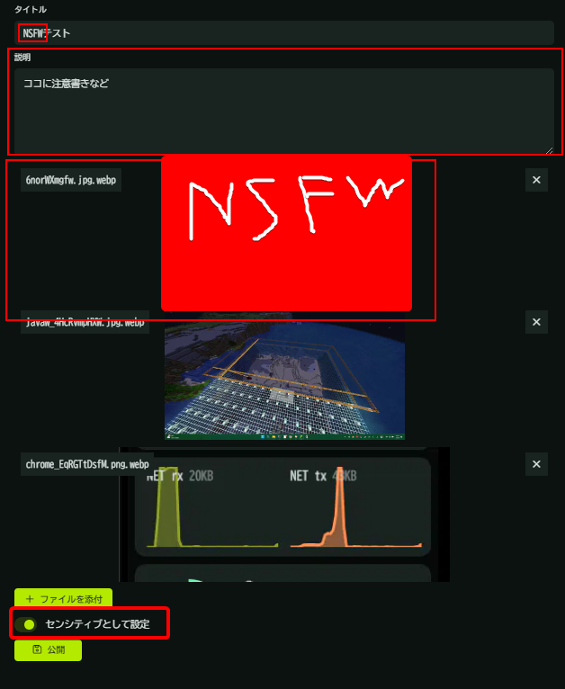

# NSFWガイドライン

::: info NSFWの基準

- 露出が多いもの
- プライベートゾーン（水着で隠れる範囲）が露出しているもの
- 職場や電車内などといった公共スペースでの閲覧に適さないもの
- 涙、汗[^1]以外の体液が描写されているもの
- 性的な意図を持って描かれたもの
- ゴア表現[^2]が含まれているもの

:::

::: warning 以下の要素が含まれるものには隠蔽処理 (モザイク処理) を行ってください

- 性器または性器を連想させる部位
- 性器結合部位と挿入部位
- アヌス結合部位と挿入部位
- 切断、裂傷などにおいて詳細かつ過度に表現されている部位（切断・裂傷部位や断面、内臓など）

:::

## NSFW 画像を投稿したい場合

- 「内容を隠す（目のマーク）」を有効にしてください
  - 注釈にNSFWまたはR-18であることを記載してください。
  - 本文にファイルの概要、及び含まれる属性を書いてください。
- NSFW画像を「[センシティブとして設定](./note_guidelines.md#閲覧注意のやり方)」してください。

これに従って投稿すると次のようになります：

\

::: tip
[NSFW イラスト投稿専用のチャンネル](https://misskey.art/channels/9bddigz7ft)も存在します。\
チャンネルを使用することで、当該チャンネルをフォローしているユーザーのタイムラインにのみ発信することができます。ご活用ください。
:::

## NSFW 画像をギャラリーに使用したい場合

以下の要件を全て満たしてください：

- タイトルに「NSFW」など「NSFW画像が含まれることが分かる文字列」が入っている
- 閲覧注意設定がされている
- ギャラリー 1枚目にクッション画像が設定されている

**どれか 1 つでも満たしていないギャラリーを発見した場合はメッセージにて連絡します**が、\
24時間以上応答がない際は**ギャラリーの削除などを行う場合があります。**

## NSFW 作品を Renote したい

- 「閲覧注意」と「内容を隠す」どちらも設定されている場合
  - そのままRenoteしても大丈夫です。
- 「閲覧注意」しか設定されていないか、あるいは何も設定されていない場合
  - **「内容を隠す」設定をした上で Renote してください。**

[^1]: 汗によって性的に見えるものはNSFW判定とします。

[^2]: 流血、欠損、虫などの暴力的な（グロテスクな）表現を指します。
