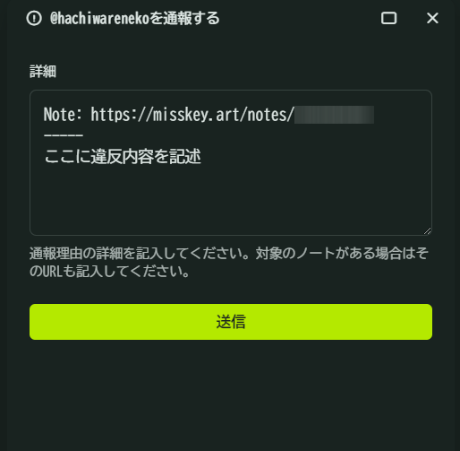

# 通報ガイドライン

## 通報機能とは？

Misskey.artのユーザーが「他のユーザーが不適切な投稿をしている」と判断した場合に、その投稿を運営に通報する機能です。\
「閲覧注意設定がされていない [NSFW 画像](./../rules.md#nsfw-not-safe-for-work-に関して) の添付されているノート」や「 [暴力的な発言](./../rules.md#ノート) の含まれるノート」などの、[ルール](./../rules.md)または[投稿ガイドライン](./note_guidelines.md)に違反している投稿を通報することができます。

通報の対応が完了するまで日数がかかる場合もあります。\
また、通報内容によっては不対応とする場合もあります。あらかじめご了承ください。

::: tip
判断に困った際は、管理者のDMまでお問い合わせください。\
**[タイムライン上など他人から見える所での言及](./../rules.md#自治行為に関して)は禁止します。**

「通報しすぎ」による処罰は原則ありません。\
むしろ「本来通報されるべき不適切な投稿がそのまま流れてしまう」ことの方が問題です。\
少しでも「問題がある」と感じたら通報をお願いします。
:::

## 注意事項

### 著作権違反の疑いがある場合

著作権を侵害している可能性のあるコンテンツ（画像や動画、文章など）を見つけた場合、**必ず以下の情報を添えて通報してください。**

1. 知的財産権所有者であることの証明、あるいは著作物が適法に掲載されている例を確認できる場所（URLや作品の制作年月、制作者が分かる情報など）
2. 報告理由（著作物の模倣である、自分が含まれている、名前を使用している、違法に掲載されているなど）

## 通報方法

### ノート

1. 通報したいノートの三点リーダーボタン「...」をクリックします。
2. 「通報」ボタンをクリックします。\
   
3. 違反内容（閲覧注意設定漏れ など）を記述し、「送信」ボタンをクリックして通報完了です。\
   

### ユーザー

1. 通報したいユーザーの三点リーダーボタン「...」をクリックします。
2. 「通報」ボタンをクリックします。\
   
3. 違反内容（アイコンが不適切 など）を記述し、「送信」ボタンをクリックして通報完了です。\
   

### 問題が発生した場合

ルールやガイドラインに違反するノートやユーザーを見つけた場合、**絶対にタイムライン上などで言及せずに**[通報ガイドライン](./report_guidelines.md)に従って通報してください。\
Discord上で起きた問題や、通報機能が使用できない場合は、以下の手順に従って運営メンバーにダイレクトメッセージを送信してください。

運営メンバーはサイドバー「みつける」→ 画面上「ロール」→「モデレーター」から確認できます。

\

