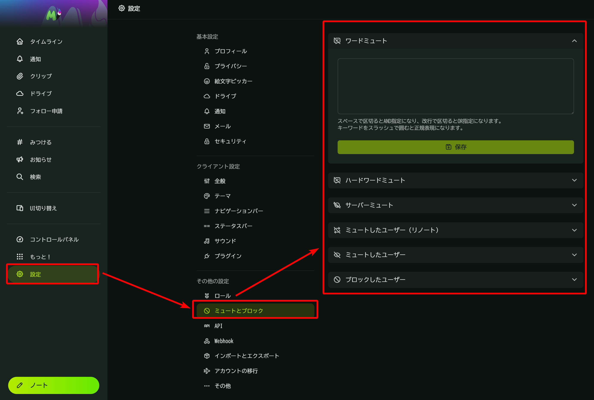
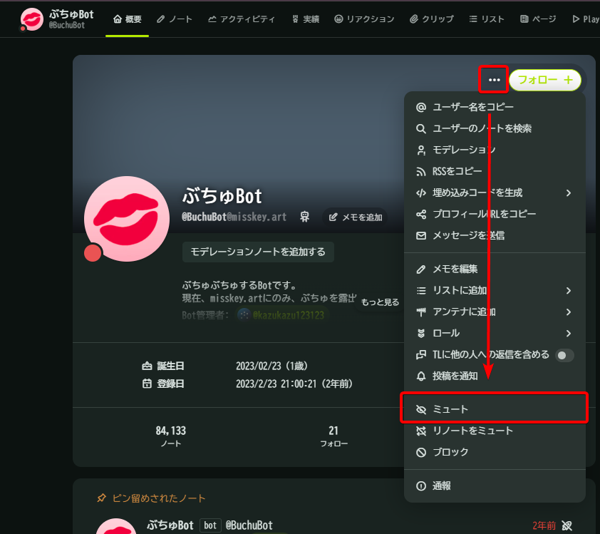
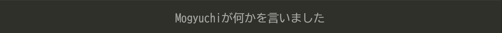

# 自衛ガイドライン

Misskeyのタイムラインには仕組み上、自分がフォローしているユーザーの投稿だけでなく、そのサーバーに属している全ユーザーや他のサーバーからの投稿が流れてきます。\
そのため、自分が苦手とするコンテンツに触れてしまい不快な気持ちになる可能性があります。

Misskeyにはそのような事態を避けるために活用できる機能群があります。

自分の苦手なこと、辛さを想起させることをMisskeyの機能を使って避け、快適なMisskeyライフに繋げていきましょう。

## 自衛のための機能

### ミュート機能

対象として指定されたものをあなたから隠す機能です。\
ミュート機能を使っても、その事実が直接的に相手に知られることはありません。

::: tip

1. ミュート機能は、過去に遡って適用されます。
2. ミュートを解除すると、ミュート中に行われたものも含め全て表示されるようになります。

ミュートをしても表示されなくなるだけであり、無かったことにされるわけではありません。
:::

#### ユーザーをミュートする

[ミュート](https://misskey-hub.net/ja/docs/for-users/features/mute-and-block/#ミュート)を使うと、対象にしたユーザーによる投稿などがあなたから見えなくなります。\
適用期間を10分・1時間・1日・1週間・無期限 の中から選択することができるので、
一時的に特定のユーザーから遠ざかるといったような使い方をすることもできます。

#### ワードをミュートする

##### [ワードミュート](https://misskey-hub.net/ja/docs/for-users/features/word-mute/)

ワードミュートをすると、指定したワードが含まれる投稿が「xxxが何かを言いました」という文章に置き換えられます。

投稿をクリックすることで元の投稿を見ることができます。
この機能を使うと、文言がダイレクトに目に入ってくることを防ぐことができます。

##### ハードワードミュート

ワードミュートと異なり、指定したワードが含まれる投稿が**完全に**表示されなくなります。

### サーバーをミュートする

サーバーミュートを使うと、指定したサーバーの投稿が表示されなくなります。
