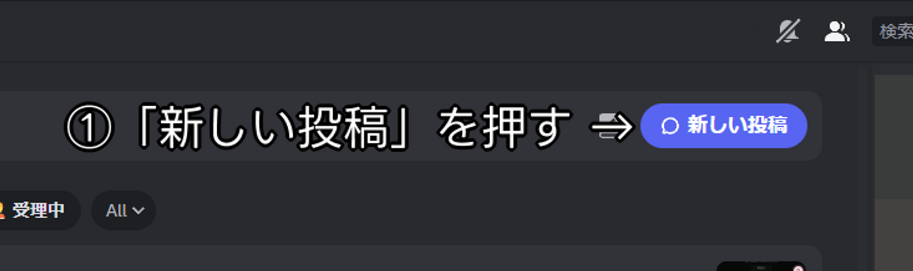
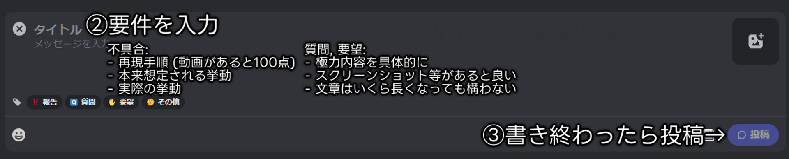

---
prev:
  text: "Misskey.art Service"
  link: "/index"
next:
  text: "ルール - Discord"
  link: "/discord_rules"
---

# ルール - Misskey.art

## はじめに

[**利用規約**](./tos.md)**及び日本の法律を遵守してください。**

以下のルールや利用規約に従っていない投稿などを確認した場合、「投稿の削除」または「該当するファイルの[NSFW フラグ](https://misskey-hub.net/ja/docs/for-users/resources/glossary/#nsfw)（閲覧注意）付与」をし、**場合によっては「アカウントのサイレンス、または[凍結](https://misskey-hub.net/ja/docs/for-users/resources/glossary/#%E5%87%8D%E7%B5%90)」を行います。**

## ルール

::: info 要約

- **遵守事項:**
  - **Misskey.art利用規約および本ルール、日本の法律、その他いわゆる「一般常識」の遵守。**
- **推奨事項:**
  - 自衛手段の設定。
- **以下の項目に該当する投稿・行為はアカウントの凍結および投稿内容削除の対象になります。**
  - **満13歳未満によるMisskey.artの利用。**
  - 誹謗中傷やヘイト行為などの暴力的な投稿。
  - 他者の知的財産権などといった権利を侵害する行為。
  - 法律に抵触する内容（画像・文章・音声を問わず）を送信する行為。
    - [「内容を隠す（CW）」と「閲覧注意」の設定をしていない状態の NSFW 画像の投稿。](./guidelines/note_guidelines.md#内容を隠す閲覧注意デフォルト閲覧注意の設定方法)
    - [「内容を隠す（CW）」を設定していない状態での NSFW 文章の投稿。](./rules.md#禁止事項)
  - [禁止事項を助長、援助する行為。](./rules.md#禁止事項)

::: warning
この要約には本ルールの一部のみが含まれており、ここに記載されていない規則も存在します。\
**必ず全文お読みください。**
:::

### ノート

**当サーバーは基本的に「苦手なものは自分で避けること」を推奨しています。**\
そのため、 **「[他者に行動を押し付ける発言](./rules.md#自治行為に関して)」は禁止されています。** 例えば、「私はこの話題がとても苦手なので、タイムライン上で話さないでください」というような発言がこれにあたります。

#### 推奨事項

- 以下の要素を含むノートのCW設定
  - 公共の場で見ることが推奨されない話題や、それらの単語が含まれるノート
    - 性的な表現やグロテスクな表現が含まれているノートも対象になります。
  - 政治的・宗教的な話題や、それらの単語が含まれるノート
    - **こちらは「創作の一部」として話す場合ならば CW 設定は不要です。ただし、「創作」であることを明記してください。**
- 自衛手段の設定
  - あらかじめ「[苦手なワードやハッシュタグ](https://misskey-hub.net/ja/docs/for-users/features/word-mute/)、[ユーザーをミュート・ブロック](https://misskey-hub.net/ja/docs/for-users/features/mute-and-block/)しておく」などの自衛手段を設定しておくことを推奨します。
  - 詳しくは[自衛ガイドライン](./guidelines/self-defense_guidelines.md)をご覧ください。

#### 禁止事項

- 日本の法律及びインターネット上において「一般的に遵守されている規則」などに違反する発言
  - これには「一般常識」なども含まれます。
- 誹謗中傷などの暴力的な発言・行動
  - 犯罪予告、あるいは他者を犯罪に誘引/勧誘する発言も含まれます。
  - 自殺予告、あるいは他者を自殺に誘引/勧誘する発言も含まれます。
- 他者に危害を及ぼす、あるいは及ぼす可能性のある発言・行動
  - 例： マルウェアや悪質なデマの拡散など
- 政治的・宗教的な活動に対して引き込む行為
  - **宣伝やそれらの思想を語る行為も含まれます。**
- あらゆる種類のヘイト行為（ヘイトスピーチ）やハラスメント
  - **人種、国籍、思想、性別、障害、職業、外見といった、個人や集団の特徴を誹謗中傷したり差別したりする**言動だけではなく、他人をそれらの言動に扇動する行為[^1] も対象です。
- 悪意の有無関係なく、想定される用途外での絵文字の使用
  - 例： 公序良俗に反する表現や、その他一般常識などにおいて忌避されているものの再現など
  - これには「[MFM による装飾](https://misskey-hub.net/ja/docs/for-users/resources/glossary/#mfm)」なども含まれます。
- 違法または特定規制対象の物品やサービス、グループに関する発言
  - **「創作の一部」として話す場合は「創作」などの明記が必要です。**
- 他者の[知的財産権](https://laws.e-gov.go.jp/document?lawid=414AC0000000122)や名誉権、プライバシー、人格権または肖像権などの権利を侵害する行為
  - これには「他者の個人情報を公開する行為」なども含まれます。
- 過度な自治行為
  - 例： 他人への行動の強制
  - 「議論」は禁止していませんが、その場合はDM機能を使用してください。
- スパム行為
  - 例： 同一メッセージの連続投稿、URLのみのノートを多数投稿など
- 処罰の回避
  - 処罰解除まで待つか、あるいは管理者まで異議申し立てをしてください。
- 他者になりすます行為
- 禁止行為を助長、援助する行為
- **AIで生成された作品（主に画像と音声）の投稿**
  ::: warning
  2024/10/17までは条件付きで投稿を許可していましたが、AIを用いた悪行の兆しが見られるようになったため一時的に制限しています。
  :::
- **投稿された作品をAIに学習させる行為**
- その他、運営が不適切と判断する発言・行為

### 不適切なファイルの投稿は禁じられています

以下のファイルの投稿は禁止されています：

- 実写での性的な画像
- 実写での暴力的な画像
- **「内容を隠す」と「閲覧注意」の設定がされていない**、[NSFW 要素](./rules.md#nsfw-not-safe-for-work-に関して)を含むファイル
- 他者へ害を及ぼすファイル（例： マルウェア）
- 他者の著作物を無断で複製したもの（例： 無断転載）\
  著作物を複製・コピーする権利は著作者のみが有するものとされています（著作権法第21条）
  - **コンテンツの出所が分かる形など一定のルールに従って行う引用は問題ありません ([著作権法第 32 条 1 項](https://laws.e-gov.go.jp/law/345AC0000000048#Mp-Ch_2-Se_3-Ss_5-At_32)、リンクを貼る行為など)**
- その他運営によって不適切と判断されるファイル

::: warning 注意
**「18歳未満の子供が関わっている実写での性的または暴力的な画像」は確認し次第該当ノートの削除とアカウント凍結を行います。また、必要に応じて関係当局およびプロバイダ通報を行います。**
:::

これらは「ダイレクトメッセージ」上であっても同様に禁じられます。

### [NSFW (Not Safe for Work)](https://misskey-hub.net/ja/docs/for-users/resources/glossary/#nsfw) に関して

> [NSFW とは(ソース: Wikipedia, 太字引用者)](https://ja.wikipedia.org/wiki/NSFW)\
> **Not safe for work**（ノット・セーフ・フォー・ワーク）の頭字語で、**職場や学校などのフォーマルな環境下での閲覧に注意を促す**ため、裸、ポルノグラフィ、卑語、暴力などの要素を含む動画やウェブサイトの URL やハイパーリンクを示す際に使われるインターネットスラング。

#### NSFW の基準

- 露出が多いもの
- プライベートゾーン（水着で隠れる範囲）が露出しているもの
- 職場や電車内などといった公共スペースでの閲覧に適さないもの
- 涙、汗[^2]以外の体液が描写されているもの
- 性的な意図を持って描かれたもの
- ゴア表現[^3]が含まれているもの

上記に相当するものを扱う場合は[NSFWガイドライン](./guidelines/nsfw_guidelines.md)を参照してください。

::: warning
お互いの自衛のため、必ず「**[閲覧注意と内容を隠すを設定](./guidelines/note_guidelines.md#内容を隠す閲覧注意デフォルト閲覧注意の設定方法)**」して投稿してください。\
また、**「注釈」の部分に「閲覧注意」設定をしたファイルの概要、及び含まれる属性を書いてください。(NSFW, R-18 など)**

<!-- AIが自動的に閲覧注意にする場合もありますが、機能していない場合は**必ず自分で閲覧注意を設定してください。** -->

「閲覧注意」と「内容を隠す」が設定されていない場合、3日以内に「該当ノートの削除」または「アカウント凍結」が行われる可能性があります。ご注意ください。

NSFWルール違反の責任は、「見てしまった未成年者」ではなく **「見せてしまった投稿者」に所在します。** \
「苦手な属性からの自衛」などもありますが、**それ以上に「法律/ルールの面で投稿者側が責任を被ってしまうことがある」ことをご理解ください。**
:::

### Bot 開発時の注意事項

以下の機能を持つBotはMisskey.art上で動作させないでください：

- 他者のコンテンツを無断転載するBot（クレジットの明記は関係ありません）
- サーバーへ負荷を掛ける機能を持つBot
- 他者への害を及ぼす機能を持つBot
- その他運営が不適切だと認めた機能を持つBot

#### 自治行為に関して

::: warning
**いかなる場合であってもやめてください。**\
問題を起こしている人がいた場合は反応せず上記手順に従って運営メンバーに連絡してください。
:::

**これは「運営メンバー自身が問題を起こしている」場合も同様です。**\
この場合は**問題を起こしている人以外の**運営メンバーに報告してください。

### 質問や要望がある場合

公式Discordサーバーの「報告など」フォーラムチャンネルを使用してください。\
ルールや規約関係の質問はMisskey内ダイレクトメッセージでも大丈夫です。

\

[^1]: 感想の範囲の意見に乗る形で、特定の個人や団体、人種などを貶め、発信元の意見をすり替える行為も扇動に含まれます。

[^2]: 汗によって性的に見えるものはNSFW判定とします。

[^3]: 流血、欠損、虫などの暴力的な（グロテスクな）表現を指します。
